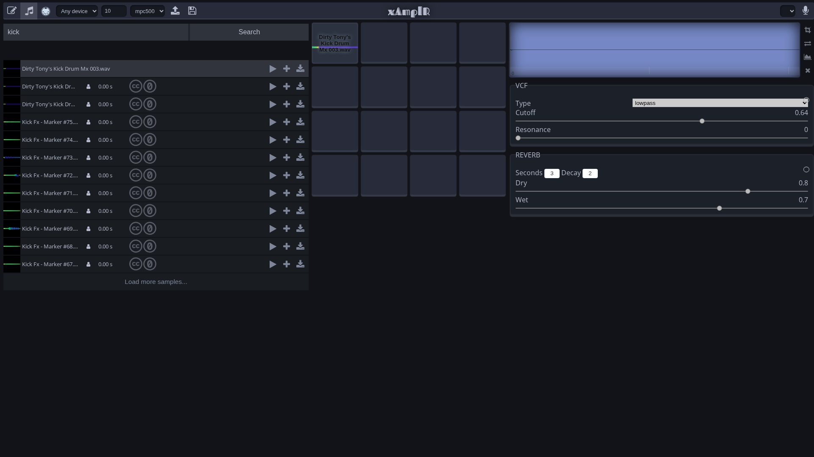

# xAmplR

A web-based audio sampler and pad controller built with Web Audio API and Web MIDI API. Record, load, and trigger audio samples in your browser.



**Live Demo:** https://alex-milanov.github.io/xAmplR/

## History

xAmplR was originally created for the **Abbey Road Hackathon** in November 2018, where it won the **"Best use of Audio Commons"** prize. The project was developed by Alex Milanov and Adrian Holder as a browser-based sampler that demonstrates how Audio Commons content can be searched, browsed, and creatively repurposed.

The hackathon took place in Abbey Road Studio One, challenging developers to create technologies for music making. xAmplR stood out by integrating Audio Commons resources to allow users to quickly search for free audio samples and trigger them live using 16 MPC-styled MIDI-enabled pads.

**Original Submission:** [Devpost - xAmplR](https://devpost.com/software/xamplr)  
**Hackathon Coverage:** [Audio Commons - Abbey Road Hackathon](https://web.archive.org/web/20240228052706/https://www.audiocommons.org/2018/12/30/abbey-road-hackathon.html)

## Features

- **Audio Sampling**: Record audio directly from your microphone
- **Pad Controller**: Trigger samples with a 16-pad grid-based interface (MPC-style)
- **Sample Library**: Search and load samples from Freesound.org (via Audio Commons)
- **Voice Search**: Search for samples using Microsoft Speech-to-Text voice recognition
- **Wave Editor**: Visual waveform editor with cropping capabilities
- **MIDI Support**: Full MIDI input support for external controllers
- **Audio Effects**: VCF (filter) and Reverb effects for sample processing
- **Waveform Visualization**: Visual representation of audio samples

## Installation

- Setup your node environment via https://github.com/creationix/nvm
- Clone the repo:
```sh
git clone https://github.com/alex-milanov/xAmplR.git
cd xAmplR
```
- Install the dependencies (using pnpm):
```sh
pnpm install
```

## Running the app

**Browser Requirements:** Web MIDI is currently supported only in Chrome-based browsers (Chrome, Edge, Opera)

1. Start the development server:
```sh
pnpm start
```

2. Open your browser at http://localhost:1234

3. The browser will request permissions for audio and MIDI - simply allow the prompts

4. Connect a MIDI controller or use the on-screen pads to start triggering samples

**Note:** The app runs on port 1234 by default (Parcel's default port)

## Live Demo

The app is automatically deployed to GitHub Pages on every push to master:
- **Live version**: https://alex-milanov.github.io/xAmplR/

## Development

**Status:** The app is currently in active development. The architecture may undergo refactorings as features are added and improved.

### Current Development Focus

- Standardization with workspace libraries (iblokz-*)
- RxJS v7 migration and iblokz-state integration (Phase 1 & 2 complete)
- Audio library migration to iblokz-audio (Phase 3 planned)
- E2E testing infrastructure with Playwright (recording, wavesurfer, and utility tests)

### App Architecture

The app architecture is influenced by functional and functional reactive programming patterns.

It's building blocks consist of:
- **State management**: Redux-inspired state machine using `iblokz-state`
- **Virtual DOM**: Hyperscript with `iblokz-snabbdom-helpers`
- **Reactive programming**: RxJS observables to connect different elements
- **Service-based architecture**: Self-contained, portable services (e.g., `audio`, `pads`, `samples`)

The application flow is one directional, flux-like:
- **Actions** -> **State** -> **UI** (-> **Actions**)

A central goal of this approach is to structure the app in a manner of how one might reason about it. For eg.:
- The `State` of the app is being changed by the user `Actions`
```js
const {actions, state$} = createState(actionsTree);
```
- The `UI` of the app reflects it's `State`
```js
const ui$ = state$.pipe(
	map(state => ui({state, actions}))
);
```

### Dependencies

The app uses several `iblokz` libraries:
- `iblokz-data` - Immutable data utilities
- `iblokz-state` - State management
- `iblokz-snabbdom-helpers` - Virtual DOM helpers
- `iblokz-audio` - Web Audio API utilities (planned for Phase 3)

### Development Scripts

- **Start**: `pnpm start` - Start development server on http://localhost:1234
- **Build**: `pnpm run build` - Build the app for production (outputs to `dist/`)
- **Lint**: `pnpm run lint` - Run ESLint on source code
- **Test**: `pnpm test:e2e` - Run E2E tests with Playwright
- **Test (headed)**: `pnpm test:e2e:headed` - Run E2E tests in headed mode (visible browser)
- **Test (recording)**: `pnpm test:recording` - Run recording functionality tests
- **Test (recorder)**: `pnpm test:recorder` - Run recorder utility tests
- **Test (wavesurfer)**: `pnpm test:e2e -- wavesurfer` - Run wavesurfer functionality tests (loading, cropping, waveform display)
- **Screenshot**: `pnpm run screenshot` - Take a screenshot of the app (requires app to be running)

### Building and Deployment

- **Build**: `pnpm run build` - Builds the app for production
- **Test**: `pnpm test:e2e` - Runs the E2E test suite with Playwright
- **Deploy**: Automatically deployed to GitHub Pages via GitHub Actions on push to `master`

## License

This project is licensed under the **GNU Affero General Public License v3.0 (AGPL-3.0)**.

See [LICENSE](LICENSE) for the full license text.
